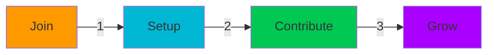

# 🌟 Nexvisora

<div align="center">
  


> 🚀 **Building Tomorrow's Technology, Together**

[](https://discord.gg/zM4w9hbP)
[](https://twitter.com/nexvisora)
[](https://github.com/nexvisora/nexvisora)
[](https://docs.github.com/authentication/securing-your-account-with-two-factor-authentication-2fa)
[](https://www.npmjs.com/package/nexvisora-ui)

---

### 🌈 **Create · Collaborate · Innovate · Design**

</div>

## ✨ What is Nexvisora?

Nexvisora is a thriving open-source community where innovation meets collaboration. We're building next-generation tools that empower developers worldwide. Our flagship project, **Nexvisora UI**, builds upon the foundation of NexCSS to deliver a comprehensive UI/UX library for modern web applications.

<table>
<tr>
<td width="50%">

### 🎯 Our Focus

- 🎨 UI/UX Design Systems
- 🔮 Advanced Visualization
- 🤖 AI/ML Integration
- 📊 Data Analytics
- 🔗 Community Collaboration

</td>
<td width="50%">

### 🌱 Why Join?

- 🚀 Drive Innovation
- 🤝 Global Community
- 📈 Continuous Learning
- ⭐ Make an Impact
- 🖌️ Shape Modern UI/UX

</td>
</tr>
</table>

## 🎨 Nexvisora UI

<div align="center">


**A modern UI/UX library that powers beautiful, responsive, and accessible web applications**

[](https://www.npmjs.com/package/nexvisora-ui)
[](https://bundlephobia.com/package/nexvisora-ui)
[](https://www.typescriptlang.org/)
[](https://github.com/nexvisora/nexvisora/blob/main/LICENSE)

</div>

### ✨ Features

<table>
<tr>
<td width="33%">
<h4>🎨 Design System</h4>
<ul>
<li>Customizable themes</li>
<li>Design tokens</li>
<li>Consistent patterns</li>
<li>Visual harmony</li>
</ul>
</td>
<td width="33%">
<h4>📱 Responsive</h4>
<ul>
<li>Mobile-first approach</li>
<li>Adaptive layouts</li>
<li>Touch optimized</li>
<li>Resolution independent</li>
</ul>
</td>
<td width="33%">
<h4>♿ Accessibility</h4>
<ul>
<li>WCAG 2.1 AA compliant</li>
<li>Keyboard navigation</li>
<li>Screen reader support</li>
<li>Focus management</li>
</ul>
</td>
</tr>
</table>

### 📦 Installation

```bash
# Using npm
npm install nexvisora-ui

# Using yarn
yarn add nexvisora-ui

# Using pnpm
pnpm add nexvisora-ui
```

### 🧩 Components

Our UI library includes a comprehensive set of components built on top of NexCSS:

<div align="center">

| Category            | Components                                               |
| ------------------- | -------------------------------------------------------- |
| 📝 **Form**         | Buttons, Inputs, Select, Checkbox, Radio, Toggle, Slider |
| 🧩 **Layout**       | Grid, Container, Divider, Space, Stack, Group            |
| 📊 **Data Display** | Table, List, Card, Badge, Avatar, Tooltip                |
| 🔔 **Feedback**     | Alert, Progress, Skeleton, Notification, Modal           |
| 🧭 **Navigation**   | Menu, Tabs, Pagination, Breadcrumb, Stepper              |

</div>

### 💄 Customization

Nexvisora UI is built with customization at its core. Configure your theme once and watch it propagate throughout all components.

```js
// Example theme configuration
import { createTheme } from "nexvisora-ui";

const theme = createTheme({
  colors: {
    primary: "#3b82f6",
    secondary: "#10b981",
    accent: "#8b5cf6",
    // ...more colors
  },
  radii: {
    sm: "0.125rem",
    md: "0.25rem",
    lg: "0.5rem",
    // ...more radius values
  },
});
```

## 🚀 Quick Start



1. **Join Our Community** 🤝

   ```bash
   # Star the repo
   ⭐ github.com/nexvisora/nexvisora

   # Join our Discord
   🎮 discord.gg/nexvisora
   ```

2. **Setup Your Environment** 🛠️

   ```bash
   # Clone repository
   git clone https://github.com/nexvisora/nexvisora.git

   # Enable 2FA (Required)
   🔐 github.com/settings/security
   ```

3. **Start Contributing** 💻

   ```bash
   # Create branch
   git checkout -b feature/amazing-idea

   # Make magic happen
   code .
   ```

## 🎨 Featured Projects

<div align="center">

| Project             | Description                 | Status                                                        |
| ------------------- | --------------------------- | ------------------------------------------------------------- |
| 🎯 **Visualizer**   | Data visualization toolkit  |  |
| 🤖 **AI Tools**     | Machine learning suite      |       |
| 📊 **Analytics**    | Advanced analytics platform |  |
| 🎨 **Nexvisora UI** | Comprehensive UI/UX library |  |

</div>

## 🌈 Community Values

<div align="center">

`Respect` • `Innovation` • `Collaboration` • `Growth` • `Security`

</div>

### 📜 Guidelines

- 🤝 Be welcoming and inclusive
- 💡 Share knowledge openly
- 🔒 Practice secure development
- 🌱 Help others grow
- ✨ Celebrate achievements

## 🔐 Security First

> **2FA is mandatory for all contributors**

- 🛡️ Regular security audits
- 🔍 Code review requirements
- 🔒 Secure development practices
- 📝 Security documentation

## 🌐 Connect With Us

<div align="center">

[](https://discord.gg/nexvisora)
[](https://twitter.com/nexvisora)
[](https://github.com/nexvisora)

</div>

---

<div align="center">

### Made with 💖 by the Global Nexvisora Community


</div>
